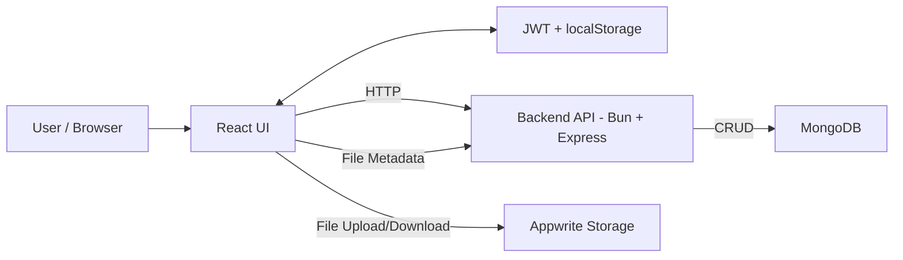

# LinkVault High-Level Architecture

This diagram captures the main components and data flows for LinkVault.

## Key Flows (Summary)
1. Auth: UI sends credentials to API, receives JWT, stores in localStorage.
2. Create Paste (Text): UI -> API -> MongoDB (Paste).
3. Create Paste (File): UI -> Appwrite Storage (file) -> API (file metadata) -> MongoDB (File, Paste).
4. View Paste: UI -> API (fetch, validate, protect, count) -> MongoDB; file downloads directly from Appwrite.
5. Dashboard: UI -> API -> MongoDB for user-specific pastes.
6. Delete: UI -> API -> MongoDB; files deleted in Appwrite when linked.
