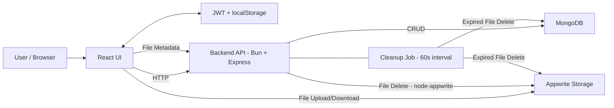

# LinkVault High-Level Architecture

This diagram captures the main components and data flows for LinkVault.

```mermaid
flowchart LR
  U[User / Browser] --> UI[React UI]
  UI <--> AUTH[JWT + localStorage]

  UI -->|HTTP| API[Backend API - Bun + Express]
  API -->|CRUD| DB[MongoDB]

  UI -->|File Upload/Download| STORE[Appwrite Storage]
  UI -->|File Metadata| API

  API -->|File Delete - node-appwrite| STORE
  CLEANUP[Cleanup Job - 60s interval] -->|Expired File Delete| STORE
  CLEANUP -->|Expired File Delete| DB
  API --- CLEANUP
```

## Key Flows (Summary)
1. Auth: UI sends credentials to API, receives JWT, stores in localStorage.
2. Create Paste (Text): UI -> API -> MongoDB (Paste).
3. Create Paste (File): UI -> Appwrite Storage (file) -> API (file metadata) -> MongoDB (File, Paste).
4. View Paste: UI -> API (fetch, validate, protect, count) -> MongoDB; file downloads directly from Appwrite. If the paste is expired or has hit its download limit, the backend calls `storage.deleteFile` (node-appwrite); on success or 404 it also removes the File document from MongoDB, then removes the Paste and returns 410. If Appwrite is unreachable the File document is left for the cleanup job to retry.
5. Dashboard: UI -> API -> MongoDB for user-specific pastes.
6. Delete: UI -> API; backend calls `storage.deleteFile` via node-appwrite, then removes the File document from MongoDB, then removes the Paste.
7. Paste TTL: MongoDB TTL index on `Paste.expiresAt` auto-deletes expired Paste documents. This is safe because Paste documents carry no Appwrite blob — only a reference to a File document, which is managed separately.
8. Background Cleanup: On server startup and every 60 seconds, the cleanup job queries MongoDB for File documents where `expiresAt <= now`. For each: call `storage.deleteFile` → on success or 404, delete the File document from MongoDB; on any other Appwrite error, skip and retry next cycle. The `File` schema has **no** MongoDB TTL index — if it did, MongoDB would delete File documents directly and bypass this job, leaving orphaned blobs in Appwrite.
