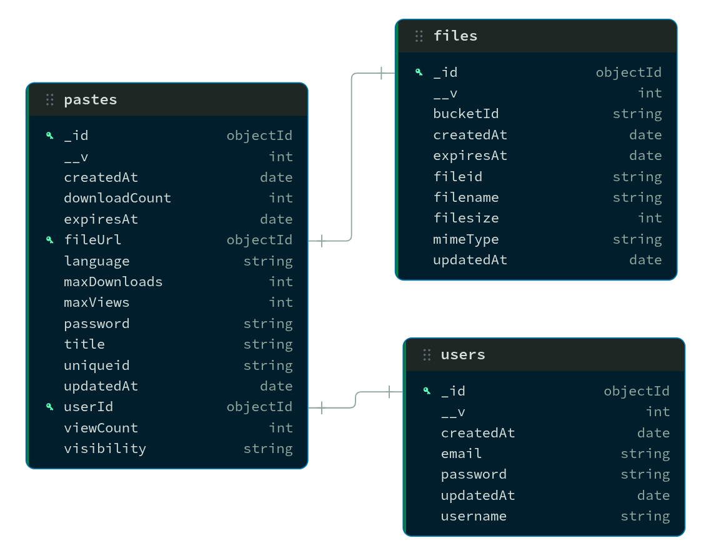

# Database Schema

High-level ER diagram image: `public/linkDB.png`

This document describes the MongoDB schemas used by the backend (Mongoose).

## User
Source: `backend/schema/user.ts`

Fields:
1. `username` (String, required, unique)
   Importance: Primary human-friendly identifier. Used to show ownership in UI and enforce unique handles.
2. `email` (String, required, unique)
   Importance: Login identifier and account recovery anchor. Enforced unique to prevent duplicate accounts.
3. `password` (String, required)
   Importance: Hashed credential for authentication (bcrypt). Never stored in plain text.
4. `createdAt` (Date, default now)
   Importance: Auditing and ordering of accounts.
5. `updatedAt` (Date, default now)
   Importance: Tracking profile updates.
6. `timestamps` (Mongoose option)
   Importance: Ensures `createdAt`/`updatedAt` are maintained automatically.

## File
Source: `backend/schema/file.ts`

Fields:
1. `fileid` (String, required, unique)
   Importance: Appwrite Storage file ID. Used to locate the blob in Appwrite.
2. `filesize` (Number, required)
   Importance: Enforces size limits and informs UI.
3. `filename` (String, required)
   Importance: Display name for downloads and UI.
4. `bucketId` (String, required)
   Importance: Identifies Appwrite bucket where the file lives.
5. `mimeType` (String, required)
   Importance: Correct download handling and preview behavior.
6. `createdAt` (Date, default now)
   Importance: Auditing and sorting.
7. `updatedAt` (Date, default now)
   Importance: Tracking metadata changes.
8. `expiresAt` (Date, optional, TTL)
   Importance: Automatic cleanup via MongoDB TTL index; supports file expiration.
9. `timestamps` (Mongoose option)
   Importance: Ensures `createdAt`/`updatedAt` are maintained automatically.

## Paste
Source: `backend/schema/paste.ts`

Fields:
1. `uniqueid` (String, default nanoid)
   Importance: Public paste identifier used in URLs.
2. `userId` (ObjectId -> User, optional)
   Importance: Ownership and access control for private pastes.
3. `title` (String, optional)
   Importance: Display label in UI and dashboard.
4. `content` (String, optional)
   Importance: Paste text content for text-based pastes.
5. `fileUrl` (ObjectId -> File, optional)
   Importance: Links paste to file metadata for file-based pastes.
6. `language` (String, enum)
   Importance: Syntax highlighting selection and validation.
7. `visibility` (String, enum)
   Importance: Access control (public/private/unlisted).
8. `password` (String, optional)
   Importance: Password protection for additional access control (stored hashed).
9. `expiresAt` (Date, optional, TTL)
   Importance: Automatic paste expiration via MongoDB TTL index.
10. `maxViews` (Number, optional)
    Importance: View-limit enforcement for “burn after reading.”
11. `viewCount` (Number, default 0)
    Importance: Tracks access; used to enforce `maxViews`.
12. `maxDownloads` (Number, optional)
    Importance: Download-limit enforcement for file pastes.
13. `downloadCount` (Number, optional)
    Importance: Tracks downloads; used to enforce `maxDownloads`.
14. `createdAt` (Date, default now)
    Importance: Auditing and sorting.
15. `updatedAt` (Date, default now)
    Importance: Tracking changes.
16. `timestamps` (Mongoose option)
    Importance: Ensures `createdAt`/`updatedAt` are maintained automatically.

## Relationships
1. `Paste.userId` -> `User._id`
   Importance: Enables private paste access control and dashboard listing.
2. `Paste.fileUrl` -> `File._id`
   Importance: Connects pastes to Appwrite file metadata.
